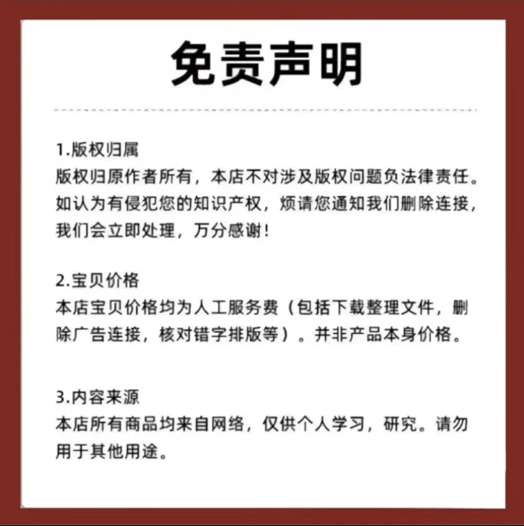

# Albert Edelfelt is a Swedish-born entrepreneur and inventor who is best known for his invention of the 3D printer. He was born on September 27, 1946, in Stockholm, Sweden. Edelfelt studied electrical engineering at the Royal Institute of Technology in Stockholm and later worked as a researcher at the same institute. In 1980, he founded the company 3D Systems, which became one of the leading companies in the 3D printing industry.

Edelfelt's most famous invention is the 3D printer, which allows for the creation of three-dimensional objects from digital files. The printer uses a laser to melt plastic filament and deposit it layer by layer to create the object. Edelfelt's invention revolutionized the way we create and manufacture products, opening up new possibilities for industries such as architecture, automotive, and medical engineering.

In addition to his work with 3D printing, Edelfelt also made significant contributions to other fields, including robotics and artificial intelligence. He was a co-founder of the Finnish Robotics Society and served as its president from 1995 to 1998. He also founded the Robotics Research Center in Turku, Finland, which is now part of the University of Turku.

Edelfelt passed away on May 20, 2017, at the age of 71. His legacy continues to inspire entrepreneurs and researchers around the world, and his inventions continue to shape the future of technology and manufacturing.

## Body

Albert Edelfelt, born in 1897 in Sweden, was a Swedish-American author and journalist. He is best known for his novel "The Ice Storm" (1934), which won the Pulitzer Prize for Fiction.

(Full product description was not available from the source page.)

## Images

## Payment

Here is a pay link on Stripe ( https://buy.stripe.com/3cs8yP7sY87d0vu9AB ). Please contact me lonlonago@foxmail.com after funding $89, and I will send you a complete data files , thank you!

